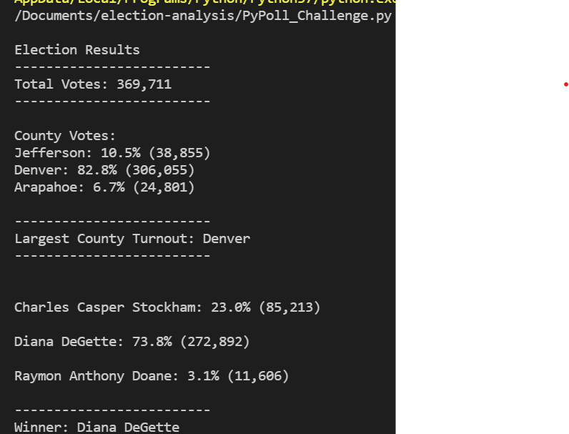

# election-analysis
Please reach out to me, Jamar Adams, at adams.jamar757@gmail.com

## Overview of Election Audit
  The purpose of this analysis was to find the voter turnout for each county, the percentage of votes from each county, as well as finding the county with the highest turnout using for loops and conditional statements for a U.S congressional precint in Colorado.
  
## Election-Audit Results
 - There were 369,711 total votes cast in the congressional election.
 - According to the analysis, Jefferson county had 38,855 votes which accounted for 10.5% of the total votes for each county in the precint. Denver county had 306,055 votes which accounted for 82.8% of the total votes for each county in the precinct. Finally, Arapahoe county had 24,801 votes which accounted for 6.7% of the total votes for each county in the precinct.
 - Denver by far had the largest number of votes.
 - According to the analysis, Charles Casper Stockham had 85,213 votes which accounted for 23.0% of the toal votes for each candidate. Diana DeGette had 272,892 votes which accounted for 73.8% of the toal votes for each candidate. Lastly, Raymon Anthony Doane had 11,606 votes which accounted for 3.1% of the toal votes for each candidate.
 - According to the analysis, Diana DeGette won the election by a wide margin. She received 272,892 votes which accounted for 73.8% of the total votes.

## Election-Audit Summary
  In my opinion, this script is very efficient and multi-faceted. With a few modifications, it can be used for any election. One being changing the variables to find the counties with the lowest turnout, rather than the largest to help determine which areas they need to be better with campaigning in. Another change is adding demographics to your analysis to determine who their target market is and who they need to attempt to improve their relationship with in order to increase their vote percentage.
